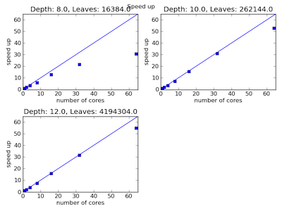
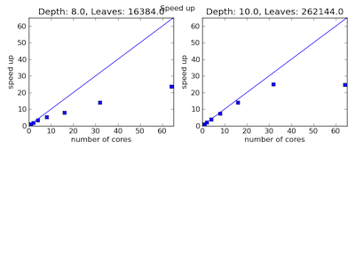

# Concurrent Models for Adaptive Mesh Refinement Using a Pointer based Quad Tree Data Structure
---

## Description
---

We have two implementations of a concurrent task based model on adaptive mesh 
refinement codes using two different languages: Go and D. We wanted to test these 
new languages with built in concurrency primitives on code models used for 
scientific computation that had previously been parallelized in the legacy style 
of bulk synchrony and static schedulers.  We developed a very simple
benchmarking test where each leaf node of the tree executes a certain amount of
work in the form of an empty for-loop.  The general process involves traversing
the tree, adding each leaf node to the work queue with the corresponding work
function, and then executing the work in the queue.  We time the process
using different numbers of cores to do the work in order to examine speed up.
We have a serial method to compare for speed up and overhead costs. 

## Installation
---
* Download and install Go and D:
	* http://golang.org/doc/install
	* http://dlang.org/download.html
* To run the post processing data analysis you need Python and Numpy
* Pull the repository
* To run the programs there are three .sh files 
	* tests.sh
		* Runs Go and D code on increasing amounts dummy work
		  ranging from 0.25 milliseconds to one millisecond on my
		  computer.  See below for details on how to determine the
		  runtime of the dummy work.
	* go.sh 
		* Command line arguments for data output file, maximum depth of
		  the tree, the number of iterations to test the work queue, the
		  number of dummy iterations, ability to set maximum cores
		* Compile using: `go build -o QuadTree`	
	* d.sh	
		* Command line arguments for data output file, maximum depth of
		  the tree, the number of iterations to test the work queue, the
		  number of dummy iterations, ability to set maximum cores
		* Compile using: `dmd QuadTree.d`
* Directories
	* dTree (for D) and goTree (for Go)
		* Tree has initial minimum depth of 4, can be changed in the
		  code
		* The code implements a simple version of the interface
		  described in the QuadTree directory in the AMR directory
* Timing
	* For each code the first command line argument specifies which function
	  to run: 0 runs concurrent tests, 1 runs serial tests, and 2 runs
	  timing tests.  In order to figure out how many dummy iterations to use 
	  for testing first use case 2 to determine the timing of the dummy work.
	* For the command line arguments, see the comments in the go.sh and d.sh
	  files  

## Go
---
* Open source systems language designed by Google
* Garbage Collected
* Built in Concurrency Primitives:
	* Goroutine: lightweight execution threads that are mapped to hardware
	  threads
	* Goroutines communicate via channels using the paradigm: do not
	  communicate by sharing memory, instead share memory by communicating.	
* Worker Queue Model: (None built-in)
	* Initiate channel to act as work queue
	* Spawn as many goroutines as hardware threads
	* Traverse the quad tree and add dummy leaf work to the queue
	* Once all the work has been added pass nil values to queue to indicate
	  all work has been completed

## D
---
* Open source systems language
* Very similar to C/C++ with some other influences (i.e. it has garbage
  collection)
* Built-in worker queue model based on std.concurrency library.
	* Traverse the quad tree and add tasks to the TaskPool which consist of
	  a node and the dummy function
	* The TaskPool handles the execution of the tasks

## Post-Processing Results
---
We use python scripts to anaylze the data generated by the Go and D code. 
* postProcess.py
	* Command line arguments: 
		* Directory names (number must be set in code, currently 2)
		* Maximum number of cores
		* Output file names (currently 3 * number of directories, 3 here
		  is the number of analyses produced per directory plus the
pickle file)
	* It generates figures for speedup, strong scaling
	* The dictionaries are saved as pickle files for reuse in overhead.py
* overhead.py
	* Command line arguments: input file prefix (data dictionary saved as pickle
	  file) and output file prefix, extensions are unnessary 
	* Max Cores and the number of data files need to be hard coded
	* Graphs the overhead cost of concurrency using the formula:
		* Concurrent work with zero interations **minus** serial work with zero iterations **divided** by the total concurrent work

## Testing Results
---
We conducted some basic benchmarking tests on the Go and D code.  We are so far
unable to calculate the overhead for the D code.  We believe that the overhead
timer is not working correctly.  The results for speed up are promising, and we
see increased speedup as more work is executed on each leaf.  The overhead for
Go is quite substantial especially when little work is done using 64 cores, but
we believe that an improved implementation of our worker queue algorithm with a
larger buffer channel could decrease the overhead.  

* _Go speed up (64 cores) when 0.25 milliseconds of work is executed on each leaf_

* _Go speed up (64 cores) when 2 milliseconds of work is executed on each leaf_

* _Go percent overhead when 0.25 milliseconds of work is executed on each leaf_

* _Go percent overhead when 2 milliseconds of work is executed on each leaf_

* _D speed up (64 cores) when 0.25 milliseconds of work is executed on each leaf_

* _D speed up (64 cores) when 2 milliseconds of work is executed on each leaf_

