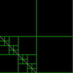

# Adaptive Mesh Refinement using a Quad Tree Data Structure
---

_AMR with Line Intersection_

## Description
---

We have written an interface and implementation for a quad tree data structure
whose nodes hold information determining their refinement level. Using the interface 
the user can implement their own refinement and coarsening criteria for both the 
individual nodes and the spatial decomposition as a whole by subclassing the 
Application class and the QuadTree class respectively.  

To illustrate this, we have implemented two subclasses of Application and two
subclasses of QuadTree.

Along with the implementation, we have also created a simple graphical depiction
of the tree using openGL and GLUT. It currently draws the tree, depicts the
neighboring nodes, and displays the line for the implementation which 'pushes' a
line through the space.  If the user wishes to draw more items, they can simply
add them to the treeRenderer class, which handles the drawing.

## Installation
Once the files have been downloaded, the user should simply be able to run
`make` to compile the files.  
**NOTE** for non Mac users, the locations of the openGL and glut libraries may
need to be changed in quadTreeVis.cpp and treeRenderer.h

## Usage
---

Currently the user chooses which version of the quad tree to use via command
line arguments.  If the user implements more subclasses they can add them to the
command line arguments or they can modify `main` to only implement their
subclasses.

### Interactions
---

* _Run (no neighbor restrictions):_ `./vis graphics step`
* _Run (neighbor restriction):_ `./vis graphics neighbor`
* When the program is run, the user can interact with the quadtree. Clicking on a rectangle (a leaf in the quad tree), refines the leaf if possible.
* If the user presses the 'c' key and then clicks on a rectangle the node is coarsened up one level if possible. Any node clicked until the 'c' key is clicked again will be coarsened.
* If the user presses the 'n' key and then clicks on a rectangle the north, south, east, and west neighbors of the node clicked on are displayed.  The north neighbors are red, the south neighbors are cyan, the east neighbors are blue, and the west neighbors are magenta.  Any node clicked until the 'n' key is clicked again will display the neighbors.
* Currently the initial size of the quad tree is set manually in the main function when the pointer to the QuadTree object is created.  

### Line Pushing
---

* _Run (line pushing):_ `./vis graphics line`
* Interaction with quad tree where a line is being pushed through the tree.  The pushing can be continuous or stopped and proceed in a step by step fashion (note step size is currently larger in the step by step process).
* If the user presses the 'd' key the line is automatically pushed and the tree coarsen and refined.  If the user presses the 'd' key again, the pushing stops.  The user can step through the process by pressing the 't' key to push the line and clicking the mouse to update the quad tree with the line in its new location.  If the user wants to return to automatic movement simply press the 'd' key again.

### No graphics
---

* _Run (no graphics):_ `./vis run`
* Here we can run tests on the quadtree
* Current Tests: 
	* Time the constructor and destructor
	* Time neighbor finding
	* Time updating the tree with coarsening and refinement breakdowns
	* Time the traversal
* In order to run these tests there are global variables to determine which
  tests to run

## File Descriptions
---

### treeRenderer.h and treeRenderer.cpp
---

* This class currently does three things
	1. Draw rectangles to visually represent the quad tree
 	2. Draw colored rectangles to visually represent the neighbors of a node
  	3. Draw text to the screen if a node cannot be coarsened or refined
* Both methods that draw rectangles take in the lower left corner coordinates of the rectangle along with the width and height
* Neighbor colors are set in the method
* Contains a Rectangle struct used to hold the information needed to draw a rectangle as described above

### QuadTree.h and QuadTree.cpp
---
 
* This class represents the quad tree which is made up of nodes (a struct in the .h file)
* Each node contains an Application (below) that determines the coarsening and
  refinement criteria for that specific node
* In terms of global refinement and coarsening criteria, the user can subclass
  the tree to override the refine and coarsen methods
* It contains many useful functions including but not limited to
	* refining and coarsening based on methods in the node class
	* neighbor finding
	* leaf finding
	* node finding given a location in world space
	* completely refines the tree with given coarsening and refinement criteria
	* others, which can be found in the .h file
* There is a maximum level of refinement
* Each node must have either four children or no children.  
* The constructor takes three variables 
	1. A pointer to the root node (gives tree correct node type)
		* To create a root Node use the subclass constructor for the node type you desire
	2. The initial number of cells in the decomposition, must be a power of 4
	3. The maximum number of levels in the tree

###  Application.h
---

* This is an abstract base class that allows the user to implement their own
  refinement and coarsening criteria for the nodes.  Note that each node has an
Application.
* Contains Segment struct that provides the information about the line.
 	
###  quadTreeVis.cpp
---

* This is the main class the implements the visualization and interaction with the quad tree.
* It implements the visualization and interactions using openGL and glut.  Since it uses openGL and glut, I used global variables in order for the gl and glut methods to have access to them.  There are global variables for the resolution of the image, information describing the world coordinates, a pointer to the QuadTree object we want to interact with, booleans to determine whether we coarsen or display neighbors instead of refine the cell, booleans to determine if we update, to determine if we step through or automatically walk through, a pointer to the segment we are pushing and information about the original intercept, and finally a string to hold the text to display to the screen
* It also has a global variable to hold the neighbor information as well as the grid information that can be passed to the treeRenderer class
* There is a method to convert from pixel to world space
* The interactions with the QuadTree return Node objects and there are methods that convert the nodes to rectangles that can be passed to the treeRenderer class
* There are standard openGL/glut methods that initialize the window, display the window, and reshape the window.
* Interactions via the keyboard and mouse are also implemented.  See the above notes for descriptions of the interactions.  The only one left out is the fact that pressing the 'esc' key closes the window.
